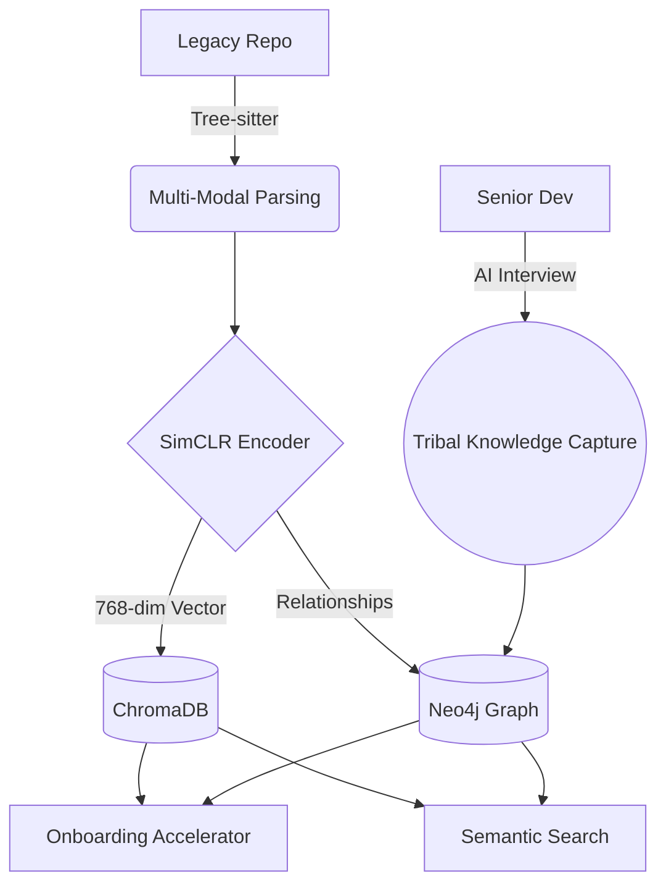

---

# 🏺 CodeArchaeologist

<b>Stop digging. Start discovering.</b>

<i>The AI-powered "Memory Engine" for legacy codebases and tribal knowledge.</i>

---

## 💡 The Problem

Software decays. When senior developers leave, they take **"Tribal Knowledge"** with them—the *why* behind the weird workarounds and the *how* of the legacy spaghetti. New developers spend **60-70% of their time** just trying to understand existing code before writing a single new line.

## 🚀 The Solution

**CodeArchaeologist** is a living map of your engineering soul. It uses state-of-the-art **Contrastive Learning** to understand the **intent** of your code, not just the syntax, while actively "interviewing" developers to capture undocumented decisions.

### 🗺️ System Architecture

---

## 🛠️ Key Features

| Section | Description | Status |
| --- | --- | --- |
| 🏺 **The Dig Site** | Auto-scans repos, detects languages, and builds dependency graphs. | `RELEASED` |
| 🧠 **The Brain** | Contrastive Learning Engine (SimCLR + GraphCodeBERT). | `BETA` |
| 🗣️ **The Interviewer** | AI chatbot that extracts knowledge from devs during PRs. | `STABLE` |
| 📊 **The Relics** | Tech Debt Tracker and Knowledge Graph visualization. | `WIP` |

---

## 🧬 Deep Tech: The ML Engine

CodeArchaeologist doesn't just look at text; it looks at *semantic structure*.

<b>📐 How Contrastive Learning Works (For Technical Judges)</b>

We use a **Multi-View Representation** of code. For every snippet, we generate:

1. **The Text View:** Raw source code.
2. **The Structural View:** Abstract Syntax Tree (AST).
3. **The Data Flow View:** How variables move (DFG).

**The Loss Function:**
We minimize the  (Normalized Temperature-scaled Cross Entropy) loss to maximize agreement between different views of the same logic:

This ensures that a "Sort" algorithm in Python and a "Sort" algorithm in C++ map to the same vector space, enabling **Cross-Language Semantic Search**.

<b>🕸️ Knowledge Graph Schema</b>

Our Neo4j layer connects the dots:

* `(Developer)-[:AUTHORED]->(Commit)`
* `(Commit)-[:MODIFIED]->(Function)`
* `(Decision)-[:EXPLAINS]->(Function)`
* `(Incident)-[:ROOT_CAUSE_IN]->(File)`

---

## 📈 Impact (The "Why")

* **Reduce Onboarding Time:** From weeks to days with personalized learning paths.
* **Zero Knowledge Leak:** Institutional memory stays in the repo, not in vanished Slack histories.
* **Smarter Refactoring:** Identify duplicate logic across different microservices instantly.

---

## 🏆 Hackathon Roadmap

* [x] Multi-language Tree-sitter integration (50+ languages)
* [x] SimCLR Contrastive Embedding Pipeline
* [x] AI Interviewer Chatbot (Claude 3.5 Sonnet Integration)
* [ ] VS Code Extension "Archaeologist Lens"
* [ ] Real-time "Fragile Code" alerts via Git Hooks
